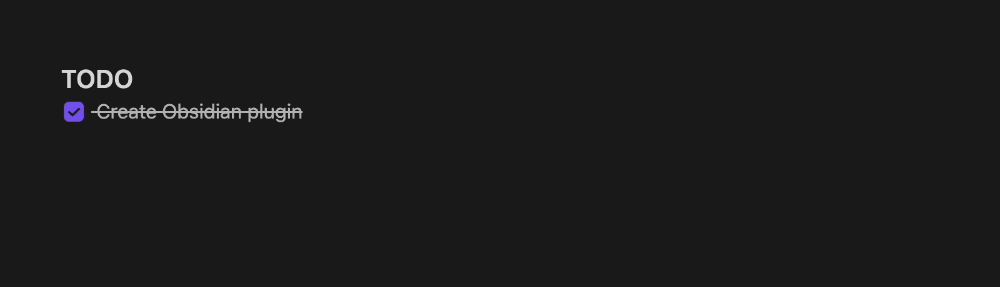
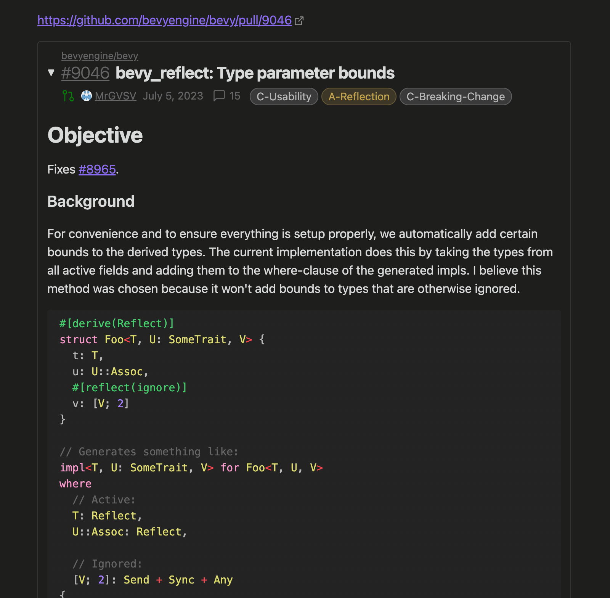
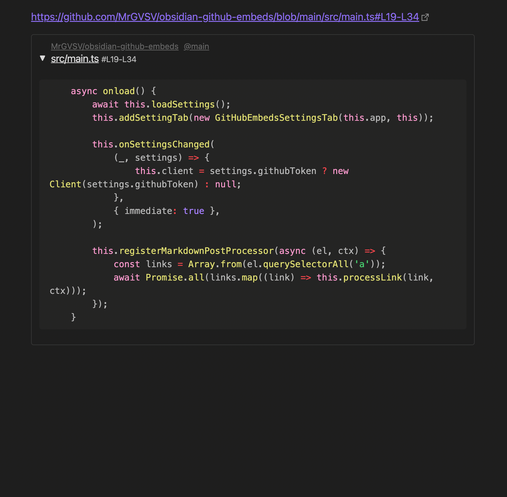

# Obsidian GitHub Embeds

*Embed GitHub issues, PRs, and code snippets directly in Obsidian.*

## Details

When in **reader mode**, the Github Embeds plugin will find all GitHub links and attempt to embed a preview below it.

#### Issues and PRs

Issues and pull requests will be displayed for any link matching one of the following:

- `https://github.com/<OWNER>/<REPO>/issues/<ISSUE NUMBER>`
- `https://github.com/<OWNER>/<REPO>/pull/<PR NUMBER>`

#### File Snippets

File snippets will be displayed when the link matches a URL like:

- `https://github.com/<OWNER>/<REPO>/blob/<REF>/<PATH TO FILE>`

Snippets can also be limited to one or more lines. If we wanted a file to only show line 12, we could append our URL with `#L12`. To show multiple lines, like 12 through 19, we could change this to read `#L12-L19`.

> **Note**
> While we can scope our files to a particular set of lines, the entire file will still need to be requested. This may result in poor performance for really large files.

#### Authentication

In order to make use of GitHub's API, calls need to be authenticated. Because of that, this plugin requires you to [create a personal access token](https://github.com/settings/tokens?type=beta) with the following permissions:

- **Contents** (*Read-only*)
- **Issues** (*Read-only*)
- **Pull requests** (*Read-only*)

With the token created, navigate to this plugin's settings and paste it into the token text field.

### Screenshots

## Todo

There are some remaining features I'd like to add:

- [ ] Display embeds in editor mode
- [ ] Opt-in/opt-out specific links
- [ ] Better configuration of issue/PR info placement
- [ ] More PR metadata (additions/deletions, check status, etc.)

The following are things that would be great but are likely out-of-scope for this project:

- Allowing issue/PR to be editable

## Support

This plugin is totally free to use! I have a lot of fun making stuff like this, so I never expect any type of financial compensation. But if you enjoy the plugin and are feeling generous, I certainly won't say no to a cup of coffee!

